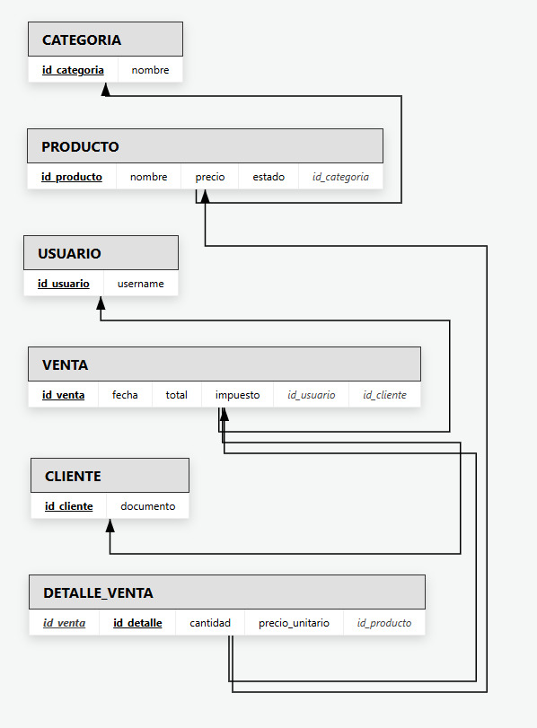

# Propuesta académica de proyecto
## Base de Datos II: Sistema de ventas (POS minimarket)

---

**📌 Nota:** Para consultar el estado actual del proyecto y el progreso de cada fase, ver archivo `PROGRESO.md`

---

## Índice
1. Introducción
2. Objetivo del proyecto
3. Justificación académica y técnica
4. Análisis del repositorio de referencia
5. Delimitación del alcance del proyecto
6. Requerimientos del sistema
7. Reglas de negocio
8. Propuesta de modelo de datos
9. Cronograma de Implementación (NUEVO)
10. Arquitectura Técnica (NUEVO)
11. Referencias
12. Conclusión
13. Anexos

---

## 1. Introducción
El presente documento desarrolla una propuesta formal para la asignatura Base de Datos II, orientada al diseño de un sistema de ventas para minimarket. La finalidad principal es estructurar una base de datos relacional que permita representar con precisión los procesos básicos de una operación comercial de mostrador. La propuesta se construye con base en evidencia técnica obtenida de un proyecto de referencia en GitHub, el cual sirve como punto de partida para definir componentes funcionales, entidades de datos y límites de implementación (betofleitass, s. f.).

Desde una perspectiva académica, el proyecto permite aplicar de manera integrada los contenidos centrales del curso: levantamiento de requerimientos, definición de reglas de negocio, modelado entidad-relación, normalización, traducción al modelo relacional y elaboración de consultas SQL para análisis operativo. En consecuencia, se plantea un alcance controlado que garantice profundidad conceptual y viabilidad de entrega.

---

## 2. Objetivo del proyecto
Diseñar e implementar una base de datos relacional para un sistema de ventas de pequeña escala, capaz de registrar clientes, productos, categorías, transacciones de venta y detalle de venta, manteniendo consistencia e integridad de la información.

### Objetivos específicos:
1. Identificar y documentar requerimientos funcionales y no funcionales del sistema.
2. Definir un conjunto claro de reglas de negocio que guíen la estructura de datos.
3. Elaborar un modelo conceptual y relacional normalizado hasta tercera forma normal.
4. Implementar la estructura lógica en PostgreSQL mediante sentencias DDL.
5. Construir consultas SQL que validen operaciones y generen información útil para toma de decisiones básicas.

---

## 3. Justificación académica y técnica
El tema POS minimarket se considera pertinente por tres razones. Primero, representa un caso real de alta frecuencia en el entorno local y, por ello, facilita la comprensión de procesos de negocio concretos. Segundo, incorpora relaciones de uno a muchos y dependencias funcionales suficientes para demostrar competencias de modelado, normalización y consultas multitabla. Tercero, su complejidad es intermedia: no es trivial, pero tampoco excede la capacidad de implementación dentro del plazo académico.

En términos metodológicos, el proyecto favorece la trazabilidad entre problema, diseño de datos y validación por consultas. Esto permite que la solución no se limite a una estructura de tablas, sino que evidencie coherencia entre requerimientos, integridad referencial y resultados esperados del sistema.

---

## 4. Análisis del repositorio de referencia
**Repositorio analizado:**
https://github.com/betofleitass/django_point_of_sale

El repositorio presenta una arquitectura modular que resulta útil como base conceptual para el proyecto. Se identifican, de forma principal, los siguientes componentes:

1. **Clientes (Customer):** almacenamiento de datos personales y de contacto.
2. **Productos y categorías (Product, Category):** clasificación comercial y precio.
3. **Ventas y detalle (Sale, SaleDetail):** registro de cabecera de transacción y desglose por ítems.
4. **Autenticación de usuarios:** control de acceso para la operación del sistema.

El valor académico del repositorio radica en que ya organiza los procesos nucleares de una venta, permitiendo adaptar su lógica a un diseño de base de datos delimitado, sin necesidad de replicar módulos no esenciales para esta fase.

---

## 5. Delimitación del alcance del proyecto
La delimitación responde al criterio de lograr una implementación sólida en un plazo corto, priorizando calidad de modelado sobre amplitud funcional.

### 5.1 Alcance incluido
1. Gestión de categorías de producto.
2. Gestión de productos con estado activo/inactivo.
3. Gestión de clientes.
4. Registro de ventas y detalle de ventas con múltiples ítems.
5. Cálculo de subtotal, impuesto, total, pago y cambio.
6. Consultas de análisis básico (ventas por fecha, clientes con mayor frecuencia de compra y productos más vendidos).

### 5.2 Alcance excluido
1. Manejo de múltiples sucursales y transferencias de inventario.
2. Módulo de compras a proveedores.
3. Devoluciones, anulaciones y notas de crédito.
4. Facturación electrónica e integraciones tributarias.
5. Despliegue en producción y arquitectura de alta disponibilidad.
6. Control avanzado de seguridad y auditoría completa.

Esta delimitación evita la sobrecarga funcional y mantiene el proyecto enfocado en los aprendizajes evaluables en Base de Datos II.

---

## 6. Requerimientos del sistema

### 6.1 Requerimientos funcionales
1. El sistema debe permitir registrar, editar y consultar clientes.
2. El sistema debe permitir registrar categorías y productos.
3. El sistema debe permitir generar una venta con uno o varios productos.
4. El sistema debe calcular automáticamente los montos de la transacción.
5. El sistema debe permitir consultar historial de ventas por cliente y por período.

### 6.2 Requerimientos no funcionales
1. La base de datos se implementará en PostgreSQL.
2. Se aplicarán claves primarias, foráneas y restricciones de integridad.
3. El modelo se normalizará hasta tercera forma normal (3FN).
4. La nomenclatura de objetos de base de datos será consistente y mantenible.
5. Las consultas de validación deberán ser reproducibles en pgAdmin.

---

## 7. Reglas de negocio
1. Toda venta debe tener al menos un detalle asociado.
2. Cada detalle de venta debe estar vinculado a un producto existente.
3. El total de una venta será la suma de subtotales de detalle más impuesto.
4. El monto pagado debe ser mayor o igual al total para calcular cambio.
5. Los productos inactivos no pueden participar en nuevas ventas.
6. La eliminación de categorías o productos con transacciones históricas no se realizará de forma física, sino lógica.

Estas reglas son fundamentales para conservar coherencia histórica y evitar inconsistencias en reportes.

---

## 8. Propuesta de modelo de datos

### 8.1 Entidades principales
1. usuario
2. cliente
3. categoria
4. producto
5. venta
6. detalle_venta

### 8.2 Relaciones principales
1. categoria (1) a (N) producto
2. cliente (1) a (N) venta
3. usuario (1) a (N) venta
4. venta (1) a (N) detalle_venta
5. producto (1) a (N) detalle_venta

### 8.3 Criterio de normalización
La estructura propuesta separa catálogos, transacciones y detalle transaccional para evitar redundancia. El precio de venta por ítem se conserva en `detalle_venta` para mantener trazabilidad histórica ante cambios de precio en `producto`. Este criterio asegura consistencia analítica y respalda consultas comparativas por período.

---

## 9. Cronograma de Implementación

### 🟢 FASE 1 - Backend SQL + Estructura ✅ COMPLETA
**Backend SQL + Estructura**

- ✅ Diseño schema.sql con 7 tablas
- ✅ Estructura carpetas (Arquitectura Limpia)
- ✅ Dependencias Python (requirements.txt)
- ✅ Configuración inicial (.env.example)
- ✅ Documentación backend

**Entregable:** `backend/` con SQL completo, estructura lista para desarrollo

---

### 🟢 FASE 2 - Poblado de Datos + API Real ✅ COMPLETA
**Poblado de Datos + Validación + Conexión PostgreSQL Real**

- ✅ Instalar PostgreSQL local
- ✅ Crear BD: `minisuper`
- ✅ Ejecutar schema.sql
- ✅ Crear seed_30_datos.sql con:
  - ✅ 3 usuarios (admin, vendedor, gerente)
  - ✅ 10 categorías de productos
  - ✅ 10 productos con precios en 2 decimales
  - ✅ 10 clientes de prueba
- ✅ Validar integridad con consultas
- ✅ Ejecutar triggers y verificar automatismos
- ✅ Reemplazar API mock con conexión PostgreSQL real
- ✅ Implementar endpoints GET CRUD
- ✅ Implementar endpoint PUT para actualizar precios

**Entregable:** BD poblada, API REST conectada a PostgreSQL, datos validados

---

### 🟡 FASE 3 - Endpoints POST/DELETE + Validación Avanzada
**Backend API - Funcionalidad Completa**

- [ ] Endpoints POST:
  - [ ] `POST /api/productos` - Crear producto
  - [ ] `POST /api/clientes` - Crear cliente
  - [ ] `POST /api/categorias` - Crear categoría
  - [ ] `POST /api/ventas` - Crear venta con detalle
- [ ] Endpoints DELETE (lógicos):
  - [ ] `DELETE /api/productos/<id>` - Marcar inactivo
  - [ ] `DELETE /api/clientes/<id>` - Marcar inactivo
- [ ] Validación y manejo de errores
- [ ] Testing con Postman
- [ ] Documentación de endpoints (README técnico)

**Entregable:** API REST CRUD completa, validada, documentada

---

### 🟡 FASE 4 - Frontend + Integración + Deploy
**Frontend + Integración + Deploy**

- [ ] Interfaz HTML/CSS/JS:
  - [ ] Login + Autenticación
  - [ ] Dashboard principal
  - [ ] Módulo de ventas (interfaz POS)
  - [ ] Gestión de clientes
  - [ ] Gestión de productos
  - [ ] Reportes básicos
- [ ] Conectar Frontend ↔ Backend
- [ ] Testing E2E (flujo completo)
- [ ] Deployment en Railway.app o Render.com
- [ ] Documentación final

**Entregable:** Aplicación completa, deployada en producción

## 10. Arquitectura Técnica

### 📐 Stack Tecnológico

| Capa | Tecnología | Versión | Propósito |
|-----|-----------|---------|----------|
| **BD** | PostgreSQL | 12+ | Motor relacional, triggers, vistas |
| **Backend** | Python + Flask | 3.9+ / 2.3+ | API REST |
| **ORM** | SQLAlchemy | 3.0+ | Mapeo objeto-relacional |
| **Autenticación** | JWT | Flask-JWT-Extended 4.4+ | Tokens seguros |
| **Seguridad** | bcrypt | 4.0+ | Hash de contraseñas |
| **Validación** | Marshmallow | 3.19+ | Serialización + DTOs |
| **Frontend** | HTML/CSS/JS | ES6+ | Interfaz usuario |
| **Deploy** | Railway/Render | - | Hosting gratuito |

---

### 🏗️ Estructura Backend (Arquitectura Limpia)

```
backend/
├── sql/
│   ├── schema.sql                 # DDL - Tablas, índices, triggers, vistas
│   ├── migrations/                # (Futuro) Versionado de cambios
│   └── seeds/                     # (Mañana) Datos iniciales
│
├── app/
│   ├── domain/                    # ENTITIES & VALUE OBJECTS
│   │   ├── models.py              # Modelos SQLAlchemy
│   │   ├── usuario.py             # Entidad Usuario
│   │   ├── producto.py            # Entidad Producto
│   │   └── venta.py               # Entidad Venta
│   │
│   ├── application/               # USE CASES & SERVICES
│   │   ├── services/
│   │   │   ├── auth_service.py    # Autenticación
│   │   │   ├── producto_service.py
│   │   │   ├── venta_service.py   # Lógica de ventas
│   │   │   └── cliente_service.py
│   │   ├── dto/                   # Data Transfer Objects
│   │   │   ├── usuario_dto.py
│   │   │   ├── venta_dto.py
│   │   │   └── producto_dto.py
│   │   └── exceptions.py          # Excepciones de negocio
│   │
│   ├── infrastructure/            # FRAMEWORKS & DRIVERS
│   │   ├── database/
│   │   │   ├── connection.py      # Pool conexiones PostgreSQL
│   │   │   ├── repositories/      # Acceso a datos
│   │   │   │   ├── usuario_repo.py
│   │   │   │   ├── producto_repo.py
│   │   │   │   └── venta_repo.py
│   │   │   └── migrations/        # Alembic (futuro)
│   │   ├── config/
│   │   │   ├── settings.py        # Configuración general
│   │   │   ├── database_config.py # Conexión BD
│   │   │   └── jwt_config.py      # JWT settings
│   │   └── external/              # APIs externas (futuro)
│   │
│   └── presentation/              # API REST
│       ├── routes/
│       │   ├── auth_routes.py     # POST /api/auth/login
│       │   ├── producto_routes.py # GET/POST /api/productos
│       │   ├── venta_routes.py    # GET/POST /api/ventas
│       │   └── cliente_routes.py  # GET/POST /api/clientes
│       └── middleware/
│           ├── auth_middleware.py # Validar JWT
│           ├── error_handler.py   # Manejo excepciones
│           └── cors_middleware.py # CORS
│
├── tests/                         # Pruebas unitarias e integración
├── main.py                        # Punto de entrada Flask
├── requirements.txt               # Dependencias pip
├── .env.example                   # Variables de entorno
├── .gitignore                     # Ignorar archivos sensibles
└── README.md                      # Documentación backend
```

---

### 🗄️ Modelo de Datos (7 Tablas)

```sql
-- Autenticación
ROLES (id_rol, nombre)
USUARIOS (id_usuario, usuario, email, contraseña_hash, id_rol)

-- Maestros
CATEGORIAS (id_categoria, nombre)
PRODUCTOS (id_producto, nombre, sku, precio_costo, precio_venta, stock_actual, id_categoria)
CLIENTES (id_cliente, nombre, email, telefono, cedula_ruc, total_compras)

-- Transacciones
VENTAS (id_venta, numero_factura, id_cliente, id_usuario, fecha_venta, subtotal, impuesto, total, metodo_pago)
DETALLE_VENTAS (id_detalle, id_venta, id_producto, cantidad, precio_unitario, subtotal_item)
```

**Características:**
- Foreign keys en todas las relaciones
- Índices en búsquedas frecuentes (cliente, producto, fecha)
- Triggers automáticos (actualiza stock, suma totales)
- Vistas para reportes (v_ventas_detalladas, v_productos_stock_critico, v_productos_desempeno)

---

### 🔐 Seguridad Implementada

| Aspecto | Implementación |
|--------|----------------|
| **Autenticación** | JWT (tokens con expiración) |
| **Contraseñas** | bcrypt + salt (12 rounds) |
| **Integridad BD** | Foreign keys + constraints |
| **Validación** | Marshmallow schemas + type hints |
| **CORS** | Configurado para desarrollo y producción |
| **Variables sensibles** | .env (no se versionan en git) |
| **Rate limiting** | A implementar en miércoles |
| **Roles** | admin, vendedor, gerente (modelo en tabla) |

---

### 📦 Dependencias Python

```
Flask==2.3.2              # Web framework
Flask-SQLAlchemy==3.0.5   # ORM
Flask-Cors==4.0.0         # CORS support
Flask-JWT-Extended==4.4.4 # JWT authentication
psycopg2-binary==2.9.6    # PostgreSQL driver
python-dotenv==1.0.0      # Environment variables
bcrypt==4.0.1             # Password hashing
marshmallow==3.19.0       # Data validation
marshmallow-sqlalchemy==0.29.0  # ORM serialization
```

---

### 🚀 Plan de Deployment (Gratuito)

**Opción Recomendada: Railway.app**

1. **Base de Datos:** PostgreSQL en Railway (gratuito, 5GB)
2. **Backend:** Python/Flask en Railway (gratuito, 512MB RAM)
3. **Frontend:** Servido desde mismo servidor Rails o GitHub Pages
4. **Dominio:** Subdominio gratuito de Railway (.up.railway.app)

**Alternativas:**
- Render.com (similar, también gratuito)
- Heroku (de pago, pero escalable)

**Proceso:**
```bash
# 1. Conectar repo a Railway
# 2. Railway automáticamente:
#    - Detecta requirements.txt
#    - Instala dependencias
#    - Crea PostgreSQL
#    - Deploya Flask
# 3. Resultado: API en https://minisuper-prod.up.railway.app
```

---

## 9. Referencias
betofleitass. (s. f.). *django_point_of_sale* [Código fuente]. GitHub.
https://github.com/betofleitass/django_point_of_sale

---

## 10. Conclusión
La propuesta de sistema de ventas para minimarket es académicamente pertinente, técnicamente viable y metodológicamente coherente con los resultados de aprendizaje de Base de Datos II.

**✨ ACTUALIZACIÓN (3 mayo 2026):** El proyecto ha avanzado significativamente completando la **FASE 1 (25% del total)**:

- ✅ **Schema SQL completo** con 7 tablas, integridad referencial, índices, vistas y triggers automáticos
- ✅ **Arquitectura Limpia** estructurada en capas (domain, application, infrastructure, presentation)
- ✅ **Stack técnico** definido (Python 3.9+, Flask 2.3+, SQLAlchemy, JWT, bcrypt, PostgreSQL 12+)
- ✅ **Documentación backend** con guía de instalación, variables de entorno y estructura completa

**Cronograma 4 días:**
- ✅ (HOY) SQL + Estructura → COMPLETADO
- ⏳ (Mañana) Poblado de datos
- ⏳ (Miércoles) API REST + Endpoints CRUD
- ⏳ (Jueves) Frontend + Deploy

El proyecto mantiene un alcance controlado para priorizar calidad del diseño relacional, integridad de información, seguridad robusta (bcrypt + JWT), y capacidad de análisis mediante SQL. Se establece una base sólida para validación funcional mediante consultas, implementación de endpoints CRUD y posterior integración con frontend.

---

## 11. Anexos

### 11.1 Diagrama E-R


### 11.2 Diagrama Entidad Relacion Mejorado (EER)


### 11.3 Esquema

